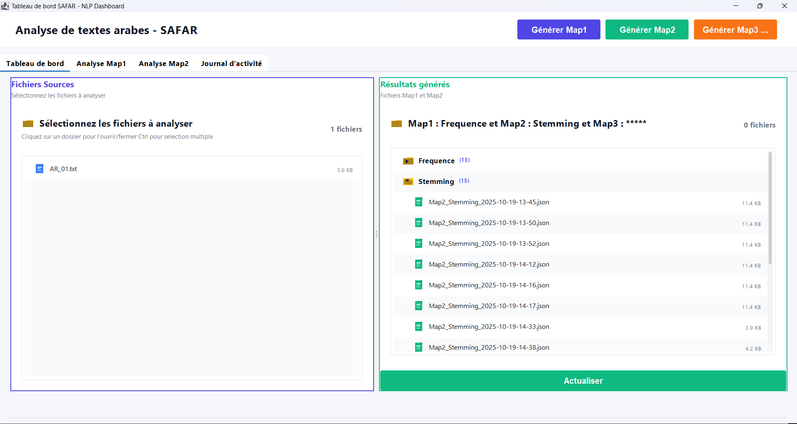
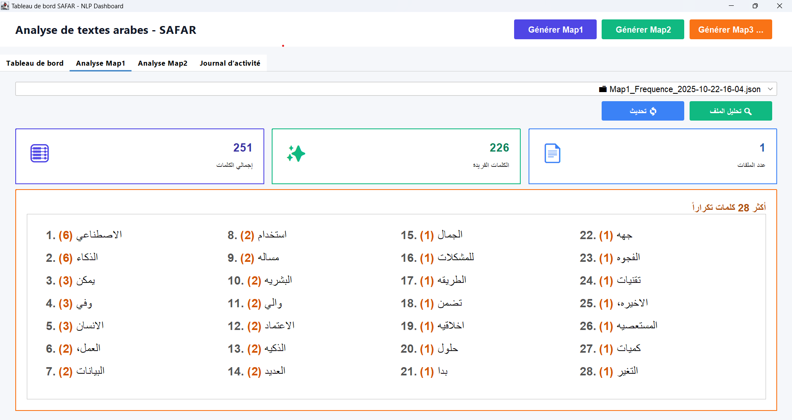
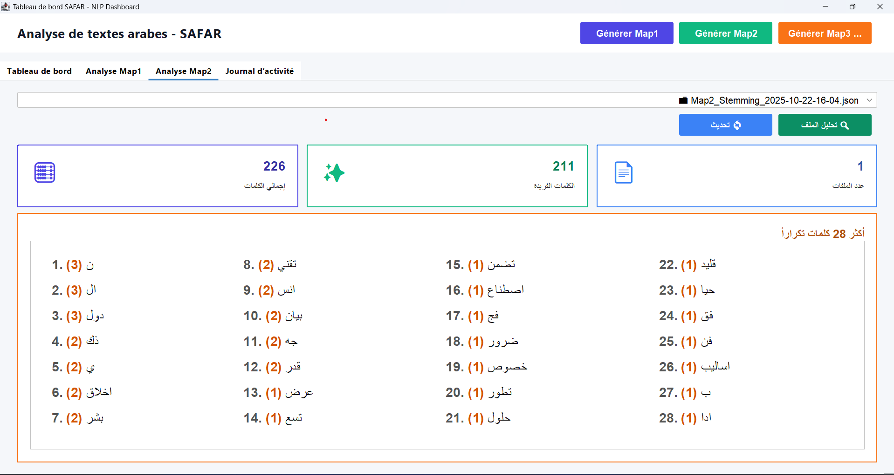

#  My-Arabic-NLP-Server

> A modern Java-based NLP desktop application for **analyzing Arabic texts**, generating frequency maps, and performing root extraction (stemming) — all visualized through an elegant Swing dashboard.

---

##  Overview

**My-Arabic-NLP-Server** is a local NLP engine built with **Java** that processes and analyzes Arabic text files.  
It allows researchers and developers to explore linguistic patterns through:
-  **Word Frequency Analysis (Map1)**
-  **Arabic Root Extraction (Map2)**
-  **Statistical Visualization Dashboard**
-  **Top Words and JSON Analytics**

All results are displayed in a **modern bilingual (Arabic/French)** interface powered by **Swing** and **Gson**.

---

##  Architecture

```

My-Arabic-NLP-Server
┣ 📂 src
┃ ┣ 📂 MainPackNLP
┃ ┃ ┣ SAFARModernUI.java        → Main Swing interface
┃ ┃ ┣ MapGenerator.java         → JSON generation logic
┃ ┃ ┣ FileBrowserUI.java        → Custom file browser
┃ ┗ 📂 data
┃   ┗ sample-texts/             → Input Arabic text files
┣ 📂 Map_Out
┃ ┣ Frequence/                  → Map1 (Word Frequency)
┃ ┗ Stemming/                   → Map2 (Root Analysis)
┗ README.md

```

---

##  Key Features

| Feature | Description |
|----------|--------------|
|  **Map1 - Frequency Analysis** | Extracts and counts all Arabic words across input text files |
|  **Map2 - Stemming (SAFAR)** | Reduces words to their root forms using SAFAR Arabic NLP rules |
|  **Dashboard** | Visual statistics (total, unique words, top N words) |
|  **Charts** | JFreeChart-based data visualization |
|  **JSON Support** | Each analysis is stored as a clean, structured `.json` file |
|  **Arabic UI Mode** | Full RTL support with Arabic labels and fonts (Amiri) |

---

##  UI Preview

| Dashboard | Map Analysis |
|------------|---------------|
|  |  |  |

---

##  Technologies Used

- **Java 17+**
- **Swing (FlatLaf)** – Modern UI for Java desktop
- **Gson** – JSON parsing & serialization
- **JFreeChart** – Data visualization
- **Arabic NLP (SAFAR API)** – For stemming and root analysis

---

##  How It Works

1. **Select Arabic text files** from the input folder  
2. Click **“Generate Map1”** → creates frequency map in JSON  
3. Click **“Generate Map2”** → performs stemming using SAFAR  
4. Analyze JSON visually (Top 20 words, total/unique counts)  
5. Review **activity logs** for every operation

---

##  License

This project is licensed under the **MIT License** — free to use and modify for academic and research purposes.

---

##  Author

**👨‍💻 Jalal Zerroudi**  
Master’s Student – Big Data & Intelligent Systems  
📍 FSDM – USMBA, Fez, Morocco  
📧 [jalal.zerroudi@gmail.com](mailto:jalal.zerroudi@gmail.com)  
🔗 [LinkedIn](https://www.linkedin.com) · [GitHub](https://github.com/Jalal-Zerroudi)

---

### 🌟 Star this repo if you find it helpful!

Souhaites-tu que je t’ajoute une version **bilingue (FR + AR)** du README — avec la description arabe alignée à droite et les sections en miroir (ex : « نظرة عامة », « المميزات », etc.) pour ton dépôt GitHub ?
Cela donnerait un look vraiment professionnel et unique pour un projet NLP arabe.
