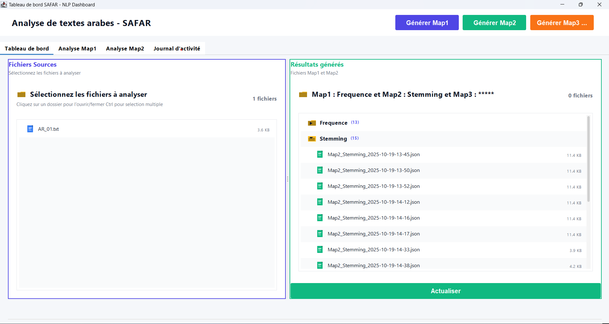
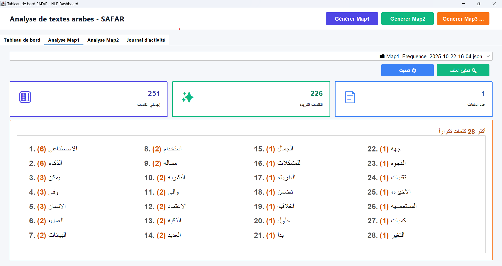
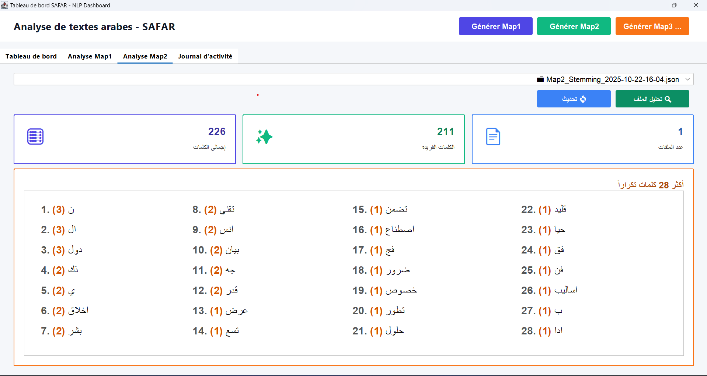

# My-Arabic-NLP-Server

A Java desktop application for analyzing Arabic text, generating frequency maps, and extracting word roots through a bilingual Arabic/French Swing interface.

## Features

| Feature | Description |
| --- | --- |
| Word-frequency analysis (Map 1) | Counts Arabic words found in selected text files |
| Root extraction (Map 2) | Applies SAFAR stemming rules to group words by root |
| Dashboard | Displays totals, unique-word counts, and the most frequent terms |
| Charts | Visualizes analysis results with JFreeChart |
| JSON output | Stores generated analyses as structured JSON files |
| Arabic interface | Supports right-to-left labels and Arabic fonts |

## Requirements

- Java Development Kit (JDK) 21
- Eclipse IDE or another Java IDE able to configure external JAR files
- The following libraries:
  - SAFAR v2
  - Gson 2.10.1
  - FlatLaf 3.6.2
  - FlatLaf Extras 3.4
  - JFreeChart 1.5.6

> [!IMPORTANT]
> The repository does not include these dependency JARs. The committed Eclipse `.classpath` currently references paths on the original developer's Windows computer, so those entries must be replaced with paths available on your machine.

## Setup and run

1. Clone the repository:

   ```bash
   git clone https://github.com/Jalal-Zerroudi/My-Arabic-NLP-Server.git
   cd My-Arabic-NLP-Server
   ```

2. Import the directory into Eclipse using **File → Import → Existing Projects into Workspace**.
3. Configure the project to use JDK 21.
4. Download or otherwise obtain the required libraries, respecting their respective licenses.
5. Open **Project → Properties → Java Build Path → Libraries** and replace the unavailable JAR entries with the local paths to your copies.
6. In **Run → Run Configurations → Arguments**, set the working directory to the repository root. The application uses relative paths for `src/data/`, `Map_Out/`, and the stop-word file.
7. Run `MainPackNLP.MainDashboardUI` as a Java application.

The application entry point is the `main` method in:

```text
src/MainPackNLP/MainDashboardUI.java
```

## Usage

1. Select one or more Arabic text files.
2. Generate **Map 1** to calculate word frequencies.
3. Generate **Map 2** to perform SAFAR-based stemming.
4. Review totals, unique words, top terms, and charts in the dashboard.
5. Consult the activity log for operation details.

> [!NOTE]
> **Map 3 is not implemented yet.** Its dashboard button only displays an informational message and does not generate an output file.

Generated results are stored under:

- `Map_Out/Frequence/` for frequency analyses
- `Map_Out/Stemming/` for stemming analyses

## Project structure

```text
My-Arabic-NLP-Server/
├── src/
│   ├── MainPackNLP/
│   │   ├── MainDashboardUI.java
│   │   ├── MapGenerator.java
│   │   ├── FileBrowserUI.java
│   │   └── safar_classes.java
│   └── data/
├── Map_Out/
│   ├── Frequence/
│   └── Stemming/
├── docs/
├── safar_classes_methods.json
├── .classpath
└── README.md
```

## UI preview

| Dashboard | Map Analysis 1 | Map Analysis 2 |
| --- | --- | --- |
|  |  |  |

## Troubleshooting

- **JAR cannot be resolved:** replace the absolute paths in the Eclipse build path with valid local paths.
- **Wrong Java version:** confirm that both the project compiler and installed JRE target Java 21.
- **Arabic text displays incorrectly:** verify that the input files use UTF-8 encoding and that an Arabic-capable font is installed.
- **No result file appears:** confirm that the application can write to the repository's `Map_Out` directories.

## License

No standalone license file is currently included in this repository. Confirm the applicable terms before redistributing or reusing the source code or third-party libraries.

## Author

**Jalal Zerroudi**  
Master's student in Big Data and Intelligent Systems  
FSDM — USMBA, Fez, Morocco  
[jalal.zerroudi@gmail.com](mailto:jalal.zerroudi@gmail.com) · [GitHub](https://github.com/Jalal-Zerroudi)
